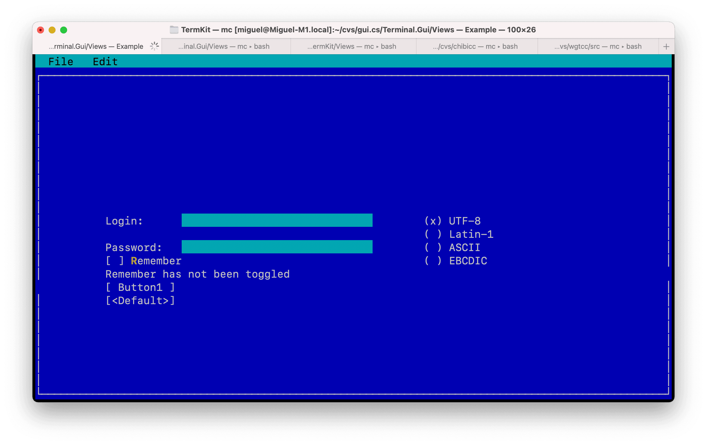

# TermKit 🧰 — Swift interfaces, right in your terminal

[](https://www.swift.org/)
[](https://developer.apple.com/macos/)
[](LICENSE)

TermKit is a Swift package for building text-based interfaces on macOS. It provides a curses-backed application loop, layout system, controls, dialogs, and an embeddable terminal view for interactive command-line tools.



## Install

TermKit is source-only and has no tagged releases. Add the `main` branch to your Swift package dependencies:

```swift
dependencies: [
    .package(url: "https://github.com/steipete/TermKit.git", branch: "main")
]
```

Then add the library product to your executable target:

```swift
.executableTarget(
    name: "MyApp",
    dependencies: [
        .product(name: "TermKit", package: "TermKit")
    ]
)
```

TermKit requires a Swift 6 toolchain and macOS 15 or newer.

## Quick start

Put this in your executable target's `main.swift`:

```swift
import TermKit

Application.prepare()

let window = Window("Hello")
window.fill()

let quit = Button("_Quit") { Application.shutdown() }
quit.isDefault = true
quit.x = Pos.center()
quit.y = Pos.center()

window.addSubviews([Label("Hello from TermKit"), quit])
Application.top.addSubview(window)
Application.run()
```

Run the package, then press Return on **Quit** to restore the terminal and exit:

```sh
swift run
```

## Compose an interface

Every interface starts with `Application.prepare()`, attaches views beneath `Application.top`, and hands control to `Application.run()`. Views can use fixed coordinates or responsive `Pos` and `Dim` rules; `fill()` expands a view to its parent.

The main control groups are:

| Need | Types |
| --- | --- |
| Windows and layout | `Window`, `Frame`, `ScrollView`, `SplitView` |
| Text and editing | `Label`, `TextField`, `TextView`, `HexView` |
| Choices and data | `Button`, `Checkbox`, `RadioGroup`, `ListView`, `DataTable` |
| Navigation | `MenuBar`, `StatusBar` |
| Prompts and files | `Dialog`, `MessageBox`, `InputBox`, `OpenDialog`, `SaveDialog` |
| Terminal sessions | `LocalProcessTerminalView` |

See the [upstream API reference](https://migueldeicaza.github.io/TermKit/index.html) and [DECISIONS.md](DECISIONS.md) for the original design notes.

## Development

Build the package and launch the bundled control gallery:

```sh
swift build
swift run Example
```

The gallery is interactive and runs in the current terminal. Xcode attachment and logging notes live in [docs/development.md](docs/development.md).

## Credits

TermKit began as [Miguel de Icaza's](https://github.com/migueldeicaza) Swift port of [gui.cs](https://github.com/migueldeicaza/gui.cs). It carries work and ideas from [Charlie Kindel](https://github.com/tig), [BDisp](https://github.com/BDisp), and the other gui.cs contributors.

## License

TermKit is available under the [MIT License](LICENSE). Copyright 2019–2022 Miguel de Icaza.
